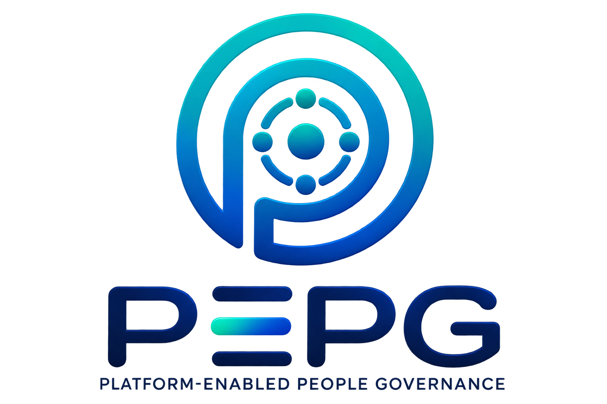

# PEPG --- Platform-Enabled People Governance

> An open governance infrastructure for transforming collective
> intelligence into transparent, verifiable, and accountable public
> problem solving.

# PEPG 3: Beyond Participation

PEPG (Platform-Enabled People Governance) is a modular governance
framework designed around a fundamental principle:

**Public problems are the primary objects of governance.**

Unlike traditional participation systems that mainly focus on voting,
discussion, or representation, PEPG connects the complete lifecycle of a
problem:

    Problem Detection
            ↓
    Registration
            ↓
    Verification
            ↓
    Contextualization
            ↓
    Discussion
            ↓
    Solution Development
            ↓
    Decision
            ↓
    Execution
            ↓
    Oversight
            ↓
    Evaluation

PEPG is not another social network. It is a governance infrastructure
that can operate on top of existing digital communities and platforms.

------------------------------------------------------------------------

# Evolution of PEPG

## PEPG 1 --- Foundation

The first version introduced the concept of Platform-Enabled People
Governance and explored how digital platforms could enable structured
public participation.

## PEPG 2 --- Governance Infrastructure

PEPG 2 introduced:

-   Problem Board
-   Persistent problem records
-   Structured governance processes
-   Community decision mechanisms

## PEPG 3 --- Modular Governance Architecture

PEPG 3 expands the framework with:

-   Identity Verification Engine
-   Trust Engine
-   Context Engine
-   Delegation Engine
-   Discussion Engine
-   Decision Engine
-   Execution Engine
-   Reporting Engine

------------------------------------------------------------------------

# System Architecture

    Users
     |
     ↓
    Identity & Verification Engine
     |
     ↓
    Trust Engine
     |
     ↓
    User Profile Layer
     |
     ↓
    Context Engine
     |
     ↓
    Problem Board
     |
     ├── Discussion Engine
     ├── Delegation Engine
     ├── Voting Engine
     |
     ↓
    Decision Engine
     |
     ↓
    Execution Engine
     |
     ↓
    Report & Accountability Layer
     |
     ↓
    Permanent Registry

------------------------------------------------------------------------

# User Identity and Verification Engine

Every participant creates a verified governance profile.

The profile contains:

-   Personal information
-   Education
-   Professional experience
-   Location
-   Workplace
-   Expertise areas
-   Current activities

Each profile attribute receives a confidence score.

Example:

    Name Verification

    100%

    Verified by:
    ✓ Official authority
    or
    ✓ Verified community members

The verification engine separates:

-   Identity
-   Trust
-   Reputation
-   Voting power

------------------------------------------------------------------------

# Trust Engine

The Trust Engine validates:

-   Identity claims
-   Expertise claims
-   Authorizations
-   Delegations
-   Governance actions

Trust is not equal to popularity.

A participant can be highly trusted in one domain without automatically
receiving authority in all domains.

------------------------------------------------------------------------

# Context Engine

The Context Engine creates semantic structure.

It manages:

-   Problem tags
-   Domain tags
-   User expertise
-   Geographic context
-   Discussion relationships
-   Knowledge ontology

Example:

    Problem:

    Water Management

    Tags:

    Environment
    Infrastructure
    Agriculture
    Local Region

Context enables relevant participation and representation.

------------------------------------------------------------------------

# Problem Board

The Problem Board is the central governance object.

Each problem contains:

-   Definition
-   Context
-   Participants
-   Discussions
-   Solutions
-   Decisions
-   Execution records
-   Reports
-   History

A problem remains a persistent object throughout its lifecycle.

------------------------------------------------------------------------

# Delegated Participation Engine

PEPG combines direct participation and representation.

A user may:

-   Vote directly on one issue
-   Delegate voting authority on another issue

Representation weight:

    Representation Weight =
    f(Person, Context, Valid Delegations)

------------------------------------------------------------------------

## Delegation Types

### Problem-Level Delegation

Delegation for an entire problem.

### Discussion-Level Delegation

Delegation only for a specific discussion.

### Domain-Level Delegation

Example:

    Artificial Intelligence
    → Representative A

    Water Management
    → Representative B

### Full Delegation

Broad authorization according to user-defined rules.

------------------------------------------------------------------------

# Delegation Rules

Delegation is:

-   Voluntary
-   Explicit
-   Contextual
-   Revocable
-   Verifiable

Delegated influence remains owned by the participant.

Example:

    1000 users
          |
          ↓
    Representative A

    300 users revoke delegation

    700 valid delegations remain

------------------------------------------------------------------------

# Discussion Engine

The Discussion Engine provides structured deliberation.

## Discussion Lifecycle

    Proposed Discussion

            ↓

    Community Approval

            ↓

    Active Discussion

            ↓

    Result Creation

            ↓

    Closure

A discussion may be created when the required participation threshold is
reached.

------------------------------------------------------------------------

# Discussion Room Features

Each discussion room supports:

-   Real-time conversation
-   Like / dislike
-   Voting
-   New discussion proposals
-   Highlight messages
-   User reporting
-   User moderation

------------------------------------------------------------------------

# Highlight System

Messages receiving strong community approval become highlights.

Example:

    Message

    ↓

    60%+ positive reaction

    ↓

    Highlighted Knowledge

------------------------------------------------------------------------

# Solution Engine

Discussion outputs can become solutions.

Two solution categories exist:

## Theoretical Solution

A conceptual resolution.

If sufficient users approve:

    Problem → Closed

## Practical Solution

A solution requiring execution.

If approved:

    Problem
       ↓
    Execution Phase

------------------------------------------------------------------------

# Execution Engine

Approved practical solutions become projects.

A project contains:

    Project

    ├── Manager
    ├── Team
    ├── Supervisors
    ├── Suppliers
    ├── Budget
    ├── Timeline
    ├── Requirements
    └── Subprojects

Project activities include:

-   Progress updates
-   Challenges
-   Requirements
-   Supervisor reports

------------------------------------------------------------------------

# Blockchain Contract Layer

Final agreements between:

-   Users
-   Executors
-   Supervisors
-   Suppliers

can be recorded using blockchain-based records.

The goal is:

-   Transparency
-   Provenance
-   Accountability

------------------------------------------------------------------------

# Report Engine

PEPG Report records the complete governance history.

Example:

    Registration

    ↓

    Verification

    ↓

    Problem Creation

    ↓

    Discussion

    ↓

    Decision

    ↓

    Execution

    ↓

    Oversight

    ↓

    Final Evaluation

User activity history contributes to future informed delegation
decisions.

------------------------------------------------------------------------

# Platform Independent Governance

PEPG does not replace existing platforms.

It can integrate with:

-   GitHub
-   Discord
-   Telegram
-   Forums
-   Other digital communities

A community may implement selected modules or the complete PEPG stack.

------------------------------------------------------------------------

# PEPG Governance Mark

Certification states:

-   Certified
-   Verified Implementation
-   Reference Implementation
-   Under Review
-   Corrective Action Required
-   Suspended
-   Revoked

Certification is module-specific.

------------------------------------------------------------------------

# Permanent Digital Registry

## Publication

PEPG 3: Beyond Participation

DOI:

https://doi.org/10.5281/zenodo.22229362

## Arweave Archive

A3xCdiVGGbVgaESreDWE8QroCcQaXuM6esoJ3sSBnTQ(https://turbo-gateway.com/A3xCdiVGGbVgaESreDWE8QroCcQaXuM6esoJ3sSBnTQ)

## Registry

[mVWSczAWIonjU0KBe0q0UfAzGFdreqiOBAE4CZRHHBM](https://turbo-gateway.com/mVWSczAWIonjU0KBe0q0UfAzGFdreqiOBAE4CZRHHBM)

## Chain of Authenticity

[VPRvmP0h77ZC3Bbl72UKIw8EzWKIuNtotXCYBWTPFZ0](https://turbo-gateway.com/VPRvmP0h77ZC3Bbl72UKIw8EzWKIuNtotXCYBWTPFZ0)

------------------------------------------------------------------------

# Repository Structure

    PEPG/

    ├── assets/
    │   ├── figures/
    │   └── logos/

    ├── docs/

    ├── papers/

    ├── prototype/

    └── registry/

------------------------------------------------------------------------

# Prototype

Live prototype:

https://miladhp94.github.io/pepg/

Repository:

https://github.com/miladhp94/pepg

------------------------------------------------------------------------

# Vision

PEPG explores a future where communities can transform distributed human
knowledge into coordinated action through transparent, contextual, and
accountable governance mechanisms.

------------------------------------------------------------------------

# Development Status

PEPG 3 is an experimental open-source research project.

Future work includes:

-   Prototype development
-   Security analysis
-   Privacy research
-   Governance simulation
-   Large-scale evaluation

------------------------------------------------------------------------

# Author

Milad Habibpour

ORCID:

https://orcid.org/0009-0001-4789-0333
